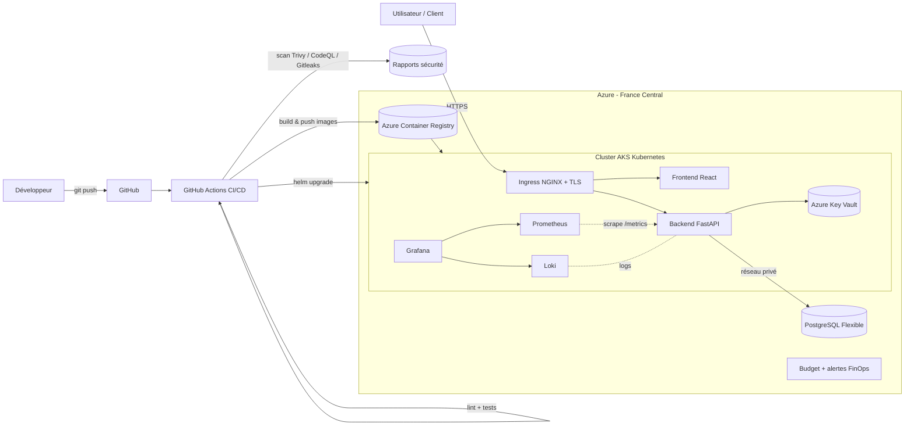
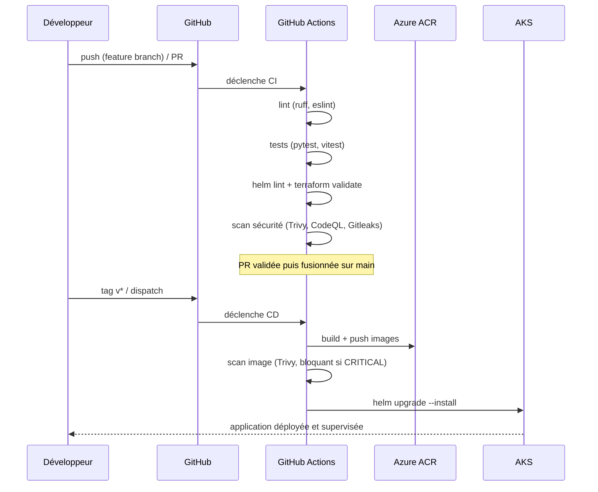
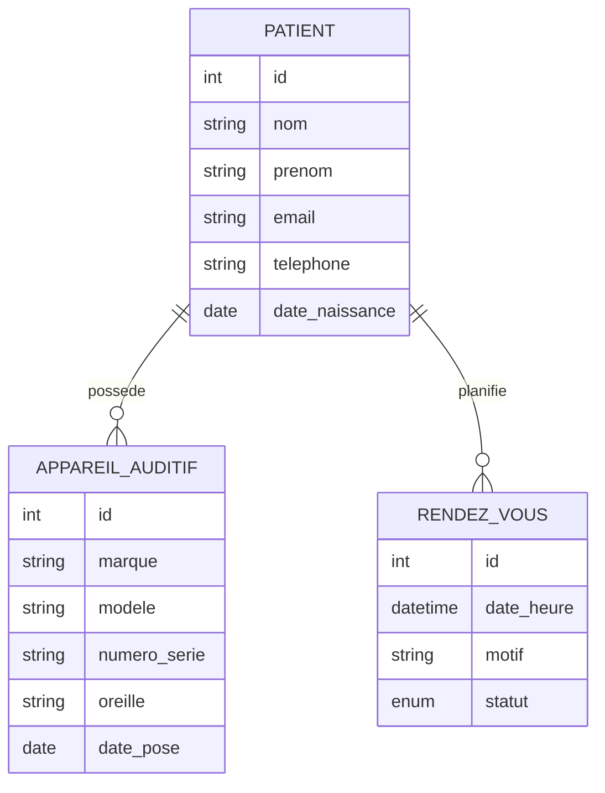

# Architecture

## 1. Vue d'ensemble

La solution adopte une architecture **cloud-native** déployée sur Azure,
orchestrée par Kubernetes (AKS), avec une chaîne CI/CD entièrement automatisée
et une supervision intégrée. Le dimensionnement est volontairement minimal pour
respecter le budget d'un compte Azure Student (85 $) tout en restant fidèle aux
exigences du cahier des charges (cloud, conteneurs, orchestration, monitoring,
sécurité, FinOps).

## 2. Composants

### Application
- **Frontend React (Vite)** : interface de gestion des patients, servie par
  un nginx non-root. Routage `/api` assuré par l'Ingress.
- **Backend FastAPI** : API REST (patients, appareils, rendez-vous), expose
  `/healthz`, `/readyz` (sondes Kubernetes) et `/metrics` (Prometheus).
- **PostgreSQL Flexible Server** : base managée, accès **privé** via un
  sous-réseau délégué (aucune IP publique).

### Plateforme
- **AKS** : cluster Kubernetes managé (plan de contrôle gratuit, 1 nœud B2s).
- **Ingress NGINX** : point d'entrée HTTP/HTTPS unique.
- **cert-manager** : émission automatique des certificats TLS (Let's Encrypt).
- **Azure Container Registry** : stockage des images, accès via identité managée
  (AcrPull), sans secret stocké.
- **Azure Key Vault** : secrets centralisés (chaîne de connexion DB), injectés
  dans les pods via le CSI Secrets Store driver + Workload Identity.

### Observabilité
- **Prometheus** : collecte des métriques (débit, latence, erreurs, ressources).
- **Grafana** : visualisation (dashboard fourni) + exploration des logs.
- **Loki + Promtail** : centralisation des logs applicatifs JSON (alternative
  économe à la stack ELK — voir `docs/monitoring.md`).

## 3. Workflow CI/CD

Étapes du pipeline, conformes au cahier des charges :
1. **Build** : compilation et génération des images Docker.
2. **Tests** : unitaires et d'intégration (backend et frontend).
3. **Scan de vulnérabilités** : Trivy (dépendances, IaC, images), CodeQL
   (analyse statique), Gitleaks (fuite de secrets).
4. **Déploiement automatisé** : Helm sur Kubernetes (AKS).

> Le cahier des charges cite GitLab CI/ArgoCD comme exemple. Le dépôt étant
> hébergé sur GitHub, nous utilisons **GitHub Actions** (équivalent fonctionnel)
> pour l'intégration et le déploiement continus. Le principe (build → test →
> scan → déploiement orchestré) est strictement respecté.

## 4. Choix d'architecture justifiés

| Décision | Justification |
|---|---|
| AKS plutôt que VM | Orchestration, auto-réparation, scalabilité (HPA), exigence pédagogique Kubernetes. |
| 1 nœud B2s | FinOps : plan de contrôle gratuit, nœud burstable à faible coût. |
| Loki plutôt qu'ELK | ELK (Elasticsearch) est lourd en RAM/CPU/stockage. Loki indexe les labels, coût d'exploitation très inférieur — adapté au budget. |
| Azure Key Vault plutôt que Vault auto-hébergé | Service managé gratuit à l'usage (pas de pod Vault à héberger/sauvegarder). Couvre l'exigence « gestion centralisée des secrets ». |
| PostgreSQL Flexible (privé) | Base managée, sauvegardes automatiques (PRA), pas d'exposition publique (sécurité). |
| Région France Central | Conformité RGPD / hébergement de données de santé (HDS). |
| Identités managées + OIDC | Aucun secret cloud stocké dans GitHub (sécurité de la chaîne). |

## 5. Données

