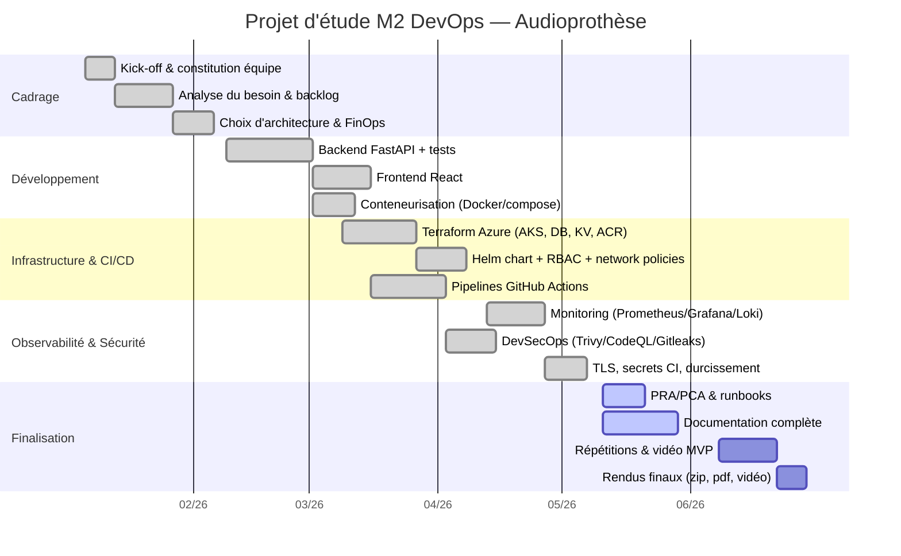

# Planning & diagramme de Gantt

Projet sur ~6 mois (kick-off → vidéo MVP + rendu technique final), en sprints
de 2 semaines.

## Jalons

| Jalon | Échéance | Livrable |
|---|---|---|
| M1 — Cadrage validé | Kick-off + 1 mois | Backlog, architecture, choix FinOps |
| M2 — MVP applicatif | + 3 mois | App conteneurisée + tests verts |
| M3 — Déploiement cloud | + 4,5 mois | Infra Terraform + CI/CD + monitoring |
| M4 — Vidéo MVP | + 6 mois | Vidéo 15-20 min (démo en production) |
| M5 — Rendu technique final | + 6 mois | Dépôt + docs + dashboards + analyse |

> Les dates sont indicatives (cf. cahier pédagogique : « toutes les dates sont
> indicatives »). À adapter au calendrier réel du campus.
